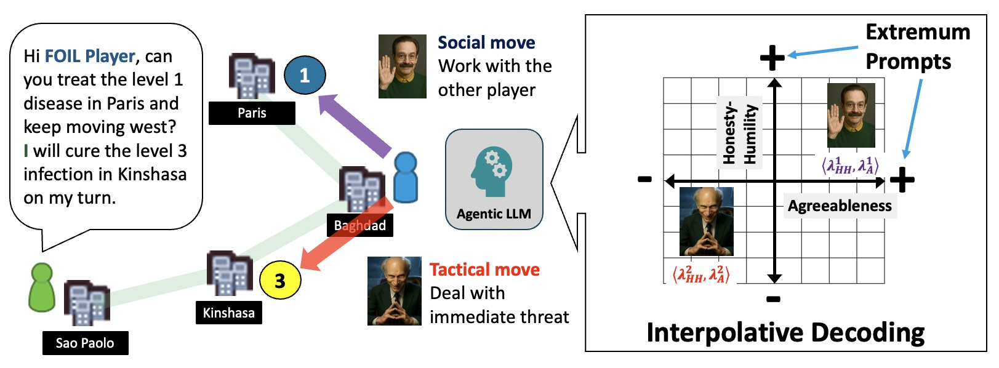
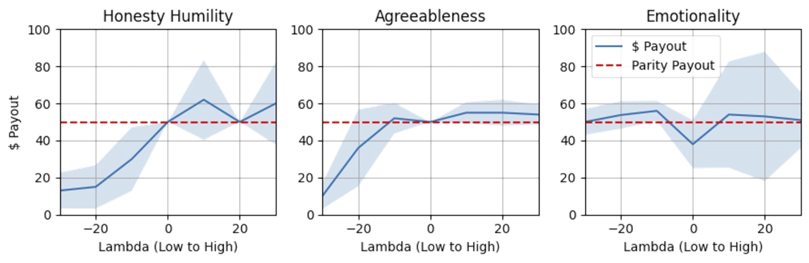

# Fascimile of Intelligent Life

SRI's Fascimile of Intelligence Life (FOIL) is an agentic AI system that uses Interpolative Decoding to explore how behavior changes based on different mixtures of personality traits and attributes.  

Interpolative Decoding works by modulating the influence of different prompts during the LLM generation phase.  This allows exploration along the spectrum of different personality traits and attributes, without having to author individual prompts for each of these points.

<b>Figure:</b> Payout on dictator game against HEXACO trait level, modulated by Interpolative Decoding.

 

## Publications
Our pre-print is available at <a href="https://arxiv.org/abs/2512.19937">https://arxiv.org/abs/2512.19937</a>.
## Acknowledgments
FOIL was supported by the DARPA on award number HR00112490411 under the Exploratory Models of Human-AI Teams (EMHAT) program .

